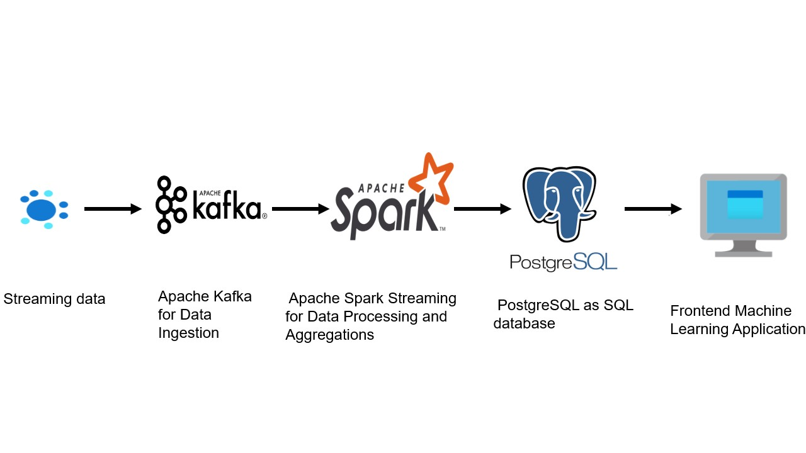

# Real-Time-Data-Streaming-with-Pyspark-Kafka-and-PostgreSQL


## Deployment Instructions for a Standalone Deployment on a Local Machine in a Docker Environment

#### Before you deploy, please ensure you have a stable internet connection to build and download maven packages for the deployment.
#### Also, if you have a local instance of Zookeeper running on port 2181, please consider shutting it down first.
For Linux users, you can do that by running the command systemctl stop <nameofzookeeperinstant>. example
```
systemctl stop zookeeper
```
For Windows users, you need to run the zookeeper-server-stop.bat script.

#### You may now deploy using the following commands:
```
git clone https://github.com/gyasifred/Real-Time-Streaming-with-Pyspark-Kafka-and-Postgresql.git  
cd Real-Time-Streaming-with-Pyspark-Kafka-and-Postgresql/producer
```
Unzip streaming_data.zip
```
unzip streaming_data.zip -d .
```
Change directory back to the base of the repository and edit the .env_config to provide the environment variable you wish to deploy your application with.
```
cd ..
vi .env_config
``` 
```text
DATABASE_HOSTNAME=
DATABASE_PORT=
DATABASE_PASSWORD=
DATABASE_NAME=
DATABASE_USERNAME=
```
Finally, at the base of the repository, deploy the application by running 

```
docker-compose --env-file .env_config up 
```
or for detach 
```
docker-compose --env-file .env_config up -d
```
To check how your data is published to the Kafka broker open a new terminal and run:
```
docker exec --interactive --tty <kafka container name> kafka-console-consumer.sh --topic temperature_readings --bootstrap-server kafka:9092
```
```text
{'id': 'uP', 'room_id/id': 'Room Admin', 'noted_date': '17-10-2018 09:45', 'temp': 38, 'out/in': 'Out'}
{'id': 'uQ', 'room_id/id': 'Room Admin', 'noted_date': '20-10-2018 05:37', 'temp': 39, 'out/in': 'Out'}
{'id': 'uR', 'room_id/id': 'Room Admin', 'noted_date': '18-10-2018 14:50', 'temp': 29, 'out/in': 'Out'}
{'id': 'uS', 'room_id/id': 'Room Admin', 'noted_date': '24-11-2018 10:01', 'temp': 40, 'out/in': 'Out'}
{'id': 'uT', 'room_id/id': 'Room Admin', 'noted_date': '24-11-2018 04:23', 'temp': 39, 'out/in': 'In'}
{'id': 'uU', 'room_id/id': 'Room Admin', 'noted_date': '17-10-2018 15:11', 'temp': 40, 'out/in': 'Out'}
{'id': 'uV', 'room_id/id': 'Room Admin', 'noted_date': '03-09-2018 23:03', 'temp': 35, 'out/in': 'Out'}
{'id': 'uW', 'room_id/id': 'Room Admin', 'noted_date': '10-09-2018 12:18', 'temp': 36, 'out/in': 'In'}
{'id': 'uX', 'room_id/id': 'Room Admin', 'noted_date': '10-09-2018 17:28', 'temp': 32, 'out/in': 'In'}
{'id': 'uY', 'room_id/id': 'Room Admin', 'noted_date': '19-09-2018 20:20', 'temp': 39, 'out/in': 'Out'}
{'id': 'uZ', 'room_id/id': 'Room Admin', 'noted_date': '14-09-2018 08:08', 'temp': 47, 'out/in': 'Out'}
{'id': 'va', 'room_id/id': 'Room Admin', 'noted_date': '17-10-2018 23:37', 'temp': 34, 'out/in': 'Out'}
{'id': 'vb', 'room_id/id': 'Room Admin', 'noted_date': '24-10-2018 07:04', 'temp': 32, 'out/in': 'In'}
{'id': 'vc', 'room_id/id': 'Room Admin', 'noted_date': '10-08-2018 08:34', 'temp': 40, 'out/in': 'Out'}
{'id': 'vd', 'room_id/id': 'Room Admin', 'noted_date': '05-12-2018 13:32', 'temp': 35, 'out/in': 'Out'}
{'id': 've', 'room_id/id': 'Room Admin', 'noted_date': '18-10-2018 00:45', 'temp': 44, 'out/in': 'Out'}
{'id': 'vf', 'room_id/id': 'Room Admin', 'noted_date': '18-10-2018 13:52', 'temp': 45, 'out/in': 'Out'}
```
Docker exec into the PostgreSQL database container and run SQL queries  in new terminal 
```
docker exec -ti  <PostgreSQL container name> psql -U <PostgreSQL user> 
```
```text
id  | room_location |      window_start      |       window_end       |  avg_temperature  
-----+---------------+------------------------+------------------------+-------------------
 484 | Out           | 2018-09-19 20:00:00+00 | 2018-09-19 20:30:00+00 |              39
 485 | Out           | 2018-09-19 23:00:00+00 | 2018-09-19 23:30:00+00 |              38
 214 | In            | 2018-10-22 01:00:00+00 | 2018-10-22 01:30:00+00 |              38
 215 | In            | 2018-10-22 03:30:00+00 | 2018-10-22 04:00:00+00 |              44
 294 | In            | 2018-12-03 03:00:00+00 | 2018-12-03 03:30:00+00 |              23
```
